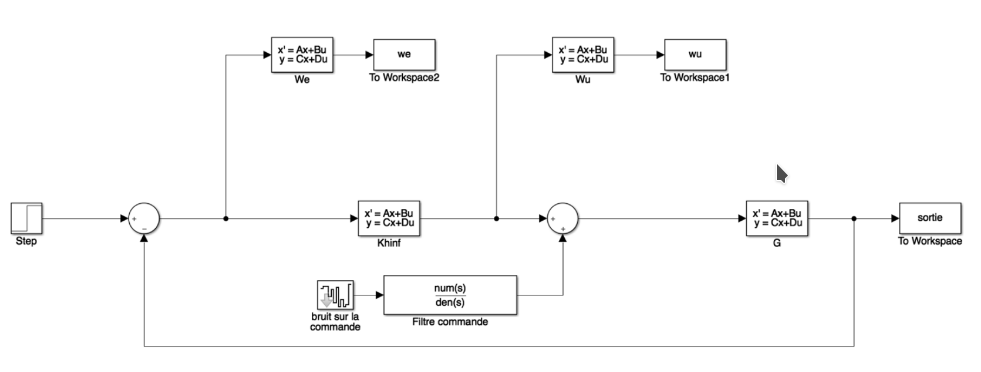

# Engineering study: Power Supply alternative to Ram Air Turbines in Aircrafts *(RAT)*

This project is my work on a use case for **"Robust and Optimal Commands"** as a 5th Year **Engineering student at ESTACA**

## Abstract

This project asked me and my team to scale a **Hinf** command for a Helicopter. The goal was to use our theoretical knowledge upon robust and optimal command in a concrete use case. Through equations and simulation, we tried to find the best parameters for this command but also concluded that even with a great performance against other commands like PI, it came at the cost of great complexity. We also study a **Hinf Loop-Shaping** command as a good *middle point* between a full and complex Hinf command and simpler ones. In the end, this project both learn us how to work with such command, but also that choosing the right command for each use case and ressources system have is also a really important challenge while building an architecture to answer system specifications.

## Summary

### I. Introduction

### II. Weighting function method

- **1. Class study validation**

- **2. Regulator determination by weighting**
	- A. Weighting functions study
	- B. Command study
	- C .Weighting function research

### III. Conclusion

## Command Test Model

